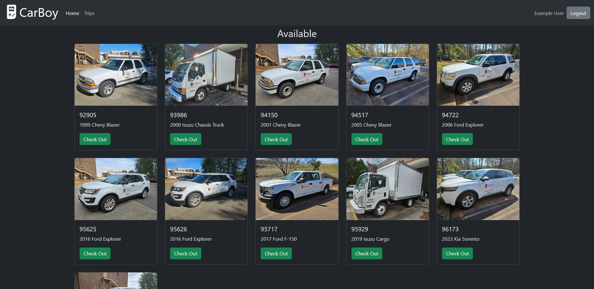

<div align="center">
    
</div>

---

A MERN application for logging vehicle use. Each vehicle can be checked out and in while logging the mileage at each point.

<div align="center">
    <div style="display: flex; flex-wrap: wrap; justify-content: space-evenly;">
        
        
        
        
    </div>
</div>

## How to Run

Download the provided `docker-compose.yml`, `SERVER_URL.js`, and `nginx.conf` files and place them in the same directory.

Ensure all environment variables in `docker-compose.yml` are set appropriately and set the application's public address in `SERVER_URL.js`.

Run CarBoy with Docker Compose!

`docker compose up -d`

## How to Build

From this directory run:

```
docker build -t cb-client ./client/
docker build -t cb-server ./server/
```

The application can then be run using the included `docker-compose.yml` file (modifying image names as needed). Be sure to set your URL in `SERVER_URL.js` and copy `nginx.conf`.
